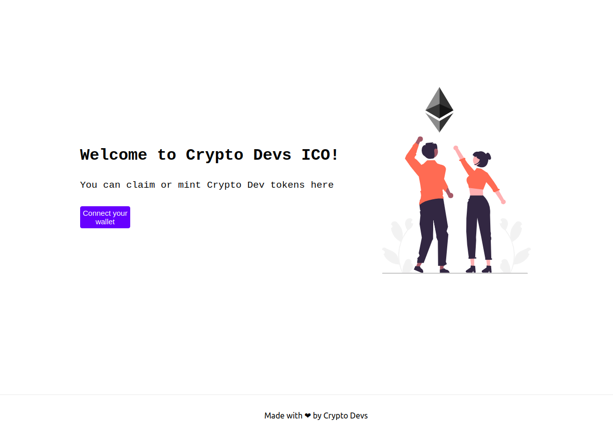

# ICO

# Launch your own Initial Coin Offering

Now it's time for you to launch a token for `Crypto Devs`. Let's call the token Crypto Dev Token.

## Requirements

- There should be a max of `10,000 CD` tokens.
- Every `Crypto Dev` NFT holder should get 10 tokens for free but they would have to pay the gas fees.
- The price of one CD at the time of ICO should be `0.001 ether`.
- There should be a website that users can visit for the ICO.

### Deployment Link    
[Click Here to visit Website](https://ico-blush.vercel.app/)
